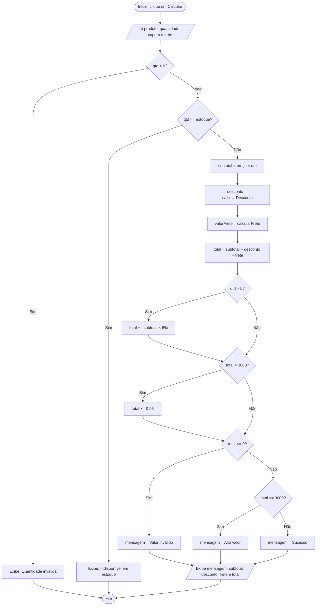
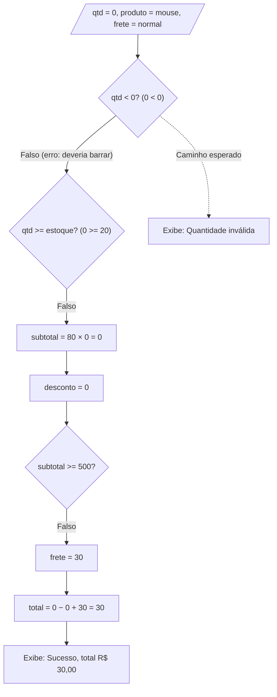
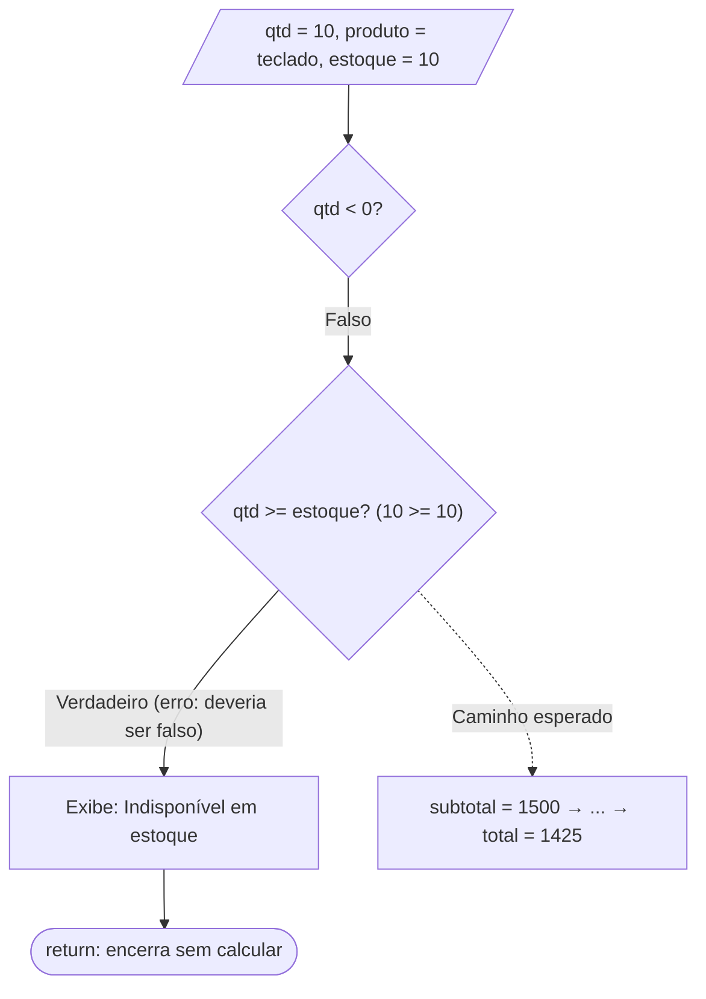
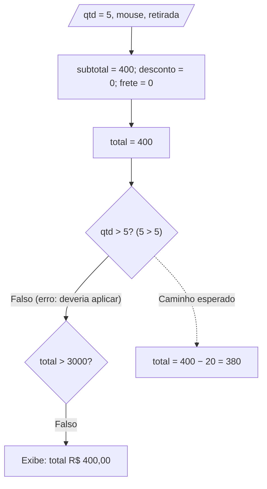
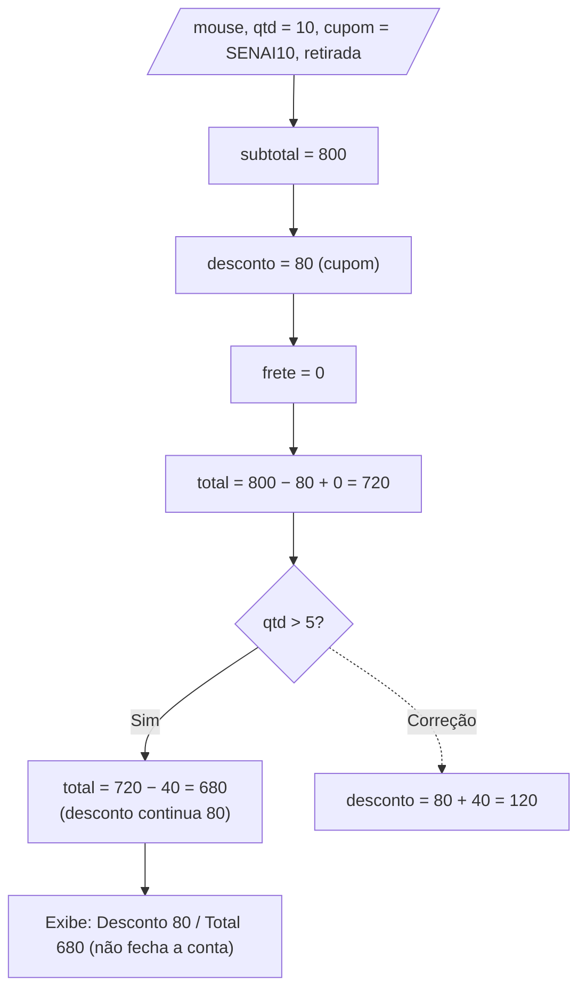
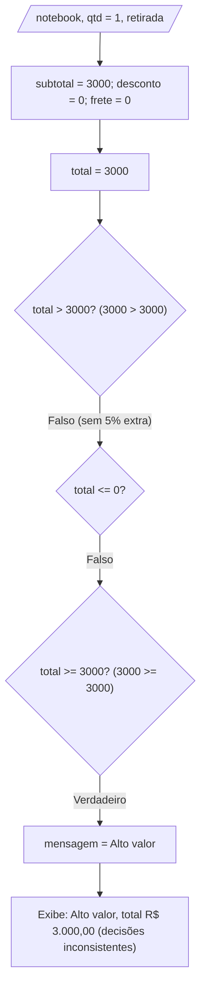
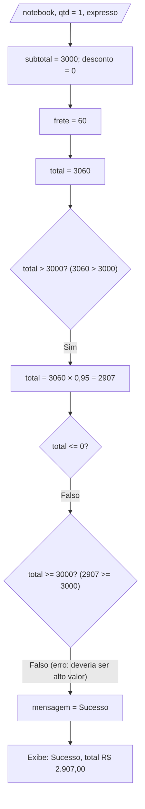

# Teste de Caixa Branca – Loja SENAI

## Capa

| | |
|---|---|
| **Instituição** | SENAI |
| **Curso** | Técnico De Desenvolvimento de Sistemas |
| **Unidade curricular** | SESI CE 356 |
| **Atividade** | Teste de Caixa Branca – Sistema de Pedidos |
| **Aluno** | Leandro Saltorato Junior |
| **Turma** | 3A |
| **Professor** | Robson, Reenye e Wellington |
| **Data** | 30/09/2026 |

---

## 1. Contextualização sobre Teste de Caixa Branca

No teste de caixa branca eu nao olho só para o que entra e o que sai do sistema: eu abro o código e testo a lógica por dentro. A ideia é passar por cada `if`, cada comparação e cada caminho possível, conferindo se o programa faz o que deveria em cada um. Isso ajuda a achar erros que passam batido num uso normal, principalmente os que só aparecem em situações específicas, como um valor exatamente no limite de uma regra

### O sistema analisado

O sistema é uma página pequena onde o usuário escolhe um produto, informa a quantidade, pode usar um cupom e escolhe o tipo de frete. Ao clicar em "Calcular pedido", o sistema mostra subtotal, desconto, frete e total. Os arquivos são `index.html`, `style.css` e `script.js`, e toda a lógica está no `script.js`.

<details>
<summary><b>Código original (script.js)</b></summary>

```js
const precos = {
  notebook: 3000,
  mouse: 80,
  teclado: 150
};

const estoque = {
  notebook: 5,
  mouse: 20,
  teclado: 10
};

const produto = document.getElementById("produto");
const quantidade = document.getElementById("quantidade");
const cupom = document.getElementById("cupom");
const frete = document.getElementById("frete");
const calcular = document.getElementById("calcular");
const resultado = document.getElementById("resultado");

function calcularDesconto(subtotal, codigo) {
  if (codigo === "SENAI10") {
    return subtotal * 0.10;
  }

  if (codigo === "SENAI20" && subtotal >= 1000) {
    return subtotal * 0.20;
  }

  return 0;
}

function calcularFrete(tipo, subtotal) {
  if (tipo === "retirada") {
    return 0;
  }

  if (tipo === "expresso") {
    return 60;
  }

  if (subtotal >= 500) {
    return 0;
  }

  return 30;
}

function finalizarPedido() {
  const produtoSelecionado = produto.value;
  const qtd = Number(quantidade.value);
  const codigo = cupom.value.trim().toUpperCase();

  if (qtd < 0) {
    resultado.innerHTML = "<p>Quantidade inválida.</p>";
    return;
  }

  if (qtd >= estoque[produtoSelecionado]) {
    resultado.innerHTML = "<p>Quantidade indisponível em estoque.</p>";
    return;
  }

  const subtotal = precos[produtoSelecionado] * qtd;
  const desconto = calcularDesconto(subtotal, codigo);
  const valorFrete = calcularFrete(frete.value, subtotal);

  let total = subtotal - desconto + valorFrete;

  if (qtd > 5) {
    total = total - subtotal * 0.05;
  }

  if (total > 3000) {
    total = total * 0.95;
  }

  let mensagem = "Pedido calculado com sucesso.";

  if (total <= 0) {
    mensagem = "Valor do pedido inválido.";
  } else if (total >= 3000) {
    mensagem = "Pedido de alto valor.";
  }

  resultado.innerHTML = `
    <p>${mensagem}</p>
    <p>Subtotal: R$ ${subtotal.toFixed(2)}</p>
    <p>Desconto: R$ ${desconto.toFixed(2)}</p>
    <p>Frete: R$ ${valorFrete.toFixed(2)}</p>
    <p class="total">Total: R$ ${total.toFixed(2)}</p>
  `;
}

calcular.addEventListener("click", finalizarPedido);
```
</details>

### Como eu defini o comportamento esperado

| Regra | O que eu espero |
|---|---|
| Quantidade | Número inteiro maior que zero |
| Estoque | Posso pedir até a quantidade em estoque, inclusive |
| Cupom `SENAI10` | 10% sobre o subtotal |
| Cupom `SENAI20` | 20% sobre o subtotal, só se o subtotal for de R$ 1.000 ou mais |
| Desconto por quantidade | 5% sobre o subtotal a partir de 5 unidades  |
| Frete | Retirada grátis; expresso R$ 60; normal R$ 30, ou grátis com subtotal a partir de R$ 500 |
| Pedido de alto valor | Total a partir de R$ 3.000, que ganha 5% extra e a mensagem "Pedido de alto valor" |
| Exibição | Subtotal − descontos + frete tem que bater com o total mostrado |

---

## 2. Análise das Estruturas de Decisão

O código só usa `if`. Não tem `switch`, operador ternário nem laço de repetição, e o único operador lógico é o `&&` do cupom SENAI20.

| # | Onde | O que é avaliado | Caminhos |
|---|---|---|---|
| D1 | `calcularDesconto` | `codigo === "SENAI10"` | Verdadeiro: 10% / Falso: vai para D2 |
| D2 | `calcularDesconto` | `codigo === "SENAI20" && subtotal >= 1000` | Verdadeiro: 20% / Falso: sem desconto |
| D3 | `calcularFrete` | `tipo === "retirada"` | Verdadeiro: R$ 0 / Falso: vai para D4 |
| D4 | `calcularFrete` | `tipo === "expresso"` | Verdadeiro: R$ 60 / Falso: vai para D5 |
| D5 | `calcularFrete` | `subtotal >= 500` | Verdadeiro: R$ 0 / Falso: R$ 30 |
| D6 | `finalizarPedido` | `qtd < 0` | Verdadeiro: "Quantidade inválida" / Falso: vai para D7 |
| D7 | `finalizarPedido` | `qtd >= estoque[produto]` | Verdadeiro: "Indisponível" / Falso: segue o cálculo |
| D8 | `finalizarPedido` | `qtd > 5` | Verdadeiro: aplica 5% / Falso: não aplica |
| D9 | `finalizarPedido` | `total > 3000` | Verdadeiro: aplica 5% extra / Falso: não aplica |
| D10 | `finalizarPedido` | `total <= 0` | Verdadeiro: "Valor inválido" / Falso: vai para D11 |
| D11 | `finalizarPedido` | `total >= 3000` | Verdadeiro: "Alto valor" / Falso: "Sucesso" |

---

## 3. Fluxograma do Exemplo

Este é o fluxo completo do sistema, do clique no botão até o resultado na tela.



---

## 4. Casos de Teste

Criei um caso de teste para cada erro que encontrei

| Identificação | Entrada | Condição/Caminho | Resultado Esperado |
|---|---|---|---|
| CT01 | Mouse, qtd 0, sem cupom, frete normal | D6 falso, D7 falso, segue o cálculo | "Quantidade inválida" |
| CT02 | Teclado, qtd 10 (igual ao estoque), sem cupom, retirada | D6 falso, D7 no limite | Pedido aceito, total R$ 1.425,00 |
| CT03 | Mouse, qtd 5, sem cupom, retirada | D8 com qtd = 5 (limite) | Desconto R$ 20,00, total R$ 380,00 |
| CT04 | Mouse, qtd 10, cupom SENAI10, retirada | D1 verdadeiro, D8 verdadeiro | Desconto exibido R$ 120,00, total R$ 680,00 |
| CT05 | Notebook, qtd 1, sem cupom, retirada (total 3000) | D9 e D11 com total = 3000 | 5% extra, total R$ 2.850,00, "Pedido de alto valor." |
| CT06 | Notebook, qtd 1, sem cupom, frete expresso (total 3060) | D9 verdadeiro, depois D11 | "Pedido de alto valor", total R$ 2.907,00 |

---

## 5. Resultados dos Testes

Executei os casos em Node.js com a mesma lógica do `script.js`, primeiro no código original e depois no corrigido

### Antes da correção

| Teste | Entrada | Resultado Esperado | Resultado Obtido | Situação |
|---|---|---|---|---|
| CT01 | Mouse, 0, sem cupom, normal | Quantidade inválida | "Pedido calculado com sucesso", total R$ 30,00 | Falhou |
| CT02 | Teclado, 10, sem cupom, retirada | Aceito, total R$ 1.425,00 | "Quantidade indisponível em estoque" | Falhou |
| CT03 | Mouse, 5, sem cupom, retirada | Total R$ 380,00 | Total R$ 400,00, sem desconto | Falhou |
| CT04 | Mouse, 10, SENAI10, retirada | Desconto R$ 120,00, total R$ 680,00 | Desconto R$ 80,00, total R$ 680,00 | Falhou |
| CT05 | Notebook, 1, sem cupom, retirada | Total R$ 2.850,00 e alto valor | Total R$ 3.000,00 e "alto valor" | Falhou |
| CT06 | Notebook, 1, sem cupom, expresso | Alto valor, total R$ 2.907,00 | "Pedido calculado com sucesso", total R$ 2.907,00 | Falhou |

### Depois da correção

| Teste | Resultado Obtido | Situação |
|---|---|---|
| CT01 | "Quantidade inválida." | Passou |
| CT02 | Subtotal 1500,00, desconto 75,00, frete 0, total 1425,00 | Passou |
| CT03 | Subtotal 400,00, desconto 20,00, total 380,00 | Passou |
| CT04 | Subtotal 800,00, desconto 120,00, total 680,00 | Passou |
| CT05 | Desconto de alto valor 150,00, total 2850,00, "Pedido de alto valor." | Passou |
| CT06 | Desconto de alto valor 153,00, total 2907,00, "Pedido de alto valor." | Passou |

---

## 6. Análise dos Resultados

Encontrei seis erros de lógica. Abaixo explico cada um, mostrando o caminho que o programa percorreu

---

### ERRO 1

**Nível:** Fácil
**Técnica usada:** análise de valores-limite

**Trecho do código:**
```js
if (qtd < 0) {
  resultado.innerHTML = "<p>Quantidade inválida.</p>";
  return;
}
```

**Comportamento esperado:** quantidade zero, campo vazio ou número decimal (como 2,5) deveriam ser recusados

**Dados do teste:** mouse, quantidade 0, sem cupom, frete normal

**Caminho percorrido:** `Number("0")` vale 0. Em D6, `0 < 0` é falso, então o programa não barra. Em D7, `0 >= 20` é falso. O subtotal fica 0, o desconto fica 0, e em D5 `0 >= 500` é falso, então o frete é 30. O total vira 30, e D8, D9, D10 e D11 dão falso, chegando em "Sucesso"

**Resultado esperado:** "Quantidade inválida"

**Resultado obtido:** "Pedido calculado com sucesso", com subtotal R$ 0,00, frete R$ 30,00 e total R$ 30,00. Ou seja, o cliente pagaria frete por zero itens

**Erro identificado:** o limite está errado. Com `< 0`, o próprio zero passa, e ele é justamente o primeiro valor inválido. Um campo vazio também vira 0 e um decimal também passa

**Correção realizada:**
```js
if (!Number.isInteger(qtd) || qtd <= 0) {
```

**Resultado após a correção:** "Quantidade inválida"

**Fluxograma:**


---

### ERRO 2

**Nível:** Fácil
**Técnica usada:** análise de valores-limite

**Trecho do código:**
```js
if (qtd >= estoque[produtoSelecionado]) {
  resultado.innerHTML = "<p>Quantidade indisponível em estoque.</p>";
  return;
}
```

**Comportamento esperado:** se existem 10 teclados em estoque, dá para comprar os 10

**Dados do teste:** teclado (estoque 10), quantidade 10, sem cupom, retirada

**Caminho percorrido:** D6 (`10 < 0`) é falso. Em D7, `10 >= 10` é verdadeiro, então o programa mostra "indisponível" e encerra com `return`, sem calcular nada

**Resultado esperado:** pedido aceito, com subtotal 1500,00, desconto 75,00 e total 1425,00

**Resultado obtido:** "Quantidade indisponível em estoque"

**Erro identificado:** o `>=` bloqueia justamente o pedido que usa todo o estoque. O correto é `>`. Por causa disso, o notebook (estoque 5) nunca poderia ser comprado em 5 unidades

**Correção realizada:**
```js
if (qtd > estoque[produtoSelecionado]) {
```

**Resultado após a correção:** o pedido é aceito, com total R$ 1.425,00. Também testei quantidade 11, que continua retornando "Quantidade indisponível em estoque."

**Fluxograma:**


---

### ERRO 3

**Nível:** Médio
**Técnica usada:** valores-limite e cobertura de decisões

**Trecho do código:**
```js
if (qtd > 5) {
  total = total - subtotal * 0.05;
}
```

**Comportamento esperado:** o desconto de 5% vale a partir de 5 unidades 

**Dados do teste:** mouse, quantidade 5, sem cupom, retirada

**Caminho percorrido:** D6 é falso e D7 (`5 >= 20`) é falso. O subtotal é 400, o desconto é 0, o frete é 0 e o total é 400. Em D8, `5 > 5` é falso, então o desconto não é aplicado. D9, D10 e D11 dão falso e o resultado é "Sucesso"

**Resultado esperado:** desconto de R$ 20,00 e total de R$ 380,00

**Resultado obtido:** total de R$ 400,00, sem desconto

**Erro identificado:** o `>` deixa de fora exatamente a quantidade que abre a faixa de desconto. O certo é `>=`

**Correção realizada:**
```js
const QTD_MINIMA_DESCONTO = 5;

if (qtd >= QTD_MINIMA_DESCONTO) {
  desconto += subtotal * 0.05;
}
```

**Resultado após a correção:** total R$ 380,00. Com 4 unidades continua sem desconto, como deve ser

**Fluxograma:**


---

### ERRO 4

**Nível:** Médio
**Técnica usada:** rastreamento de variáveis

**Trecho do código:**
```js
const desconto = calcularDesconto(subtotal, codigo);
let total = subtotal - desconto + valorFrete;

if (qtd > 5) {
  total = total - subtotal * 0.05;
}

resultado.innerHTML = `
  <p>Desconto: R$ ${desconto.toFixed(2)}</p>
`;
```

**Comportamento esperado:** o desconto mostrado na tela deve ser a soma de todos os descontos aplicados (cupom e quantidade), para que subtotal − desconto + frete dê o total

**Dados do teste:** mouse, quantidade 10, cupom SENAI10, retirada

**Caminho percorrido:** o subtotal é 800. Em D1 o cupom vale, então `desconto` = 80. O frete é 0 e o total é 800 − 80 = 720. Em D8, `10 > 5` é verdadeiro e o total vira 720 − 40 = 680. Só que a variável `desconto` continua valendo 8

**Resultado esperado:** desconto de R$ 120,00 (80 + 40) e total de R$ 680,00

**Resultado obtido:** subtotal 800,00, desconto 80,00, frete 0,00 e total 680,00. Quem confere a conta na tela vê 800 − 80 = 720 e não entende por que o total é 680

**Erro identificado:** o desconto por quantidade mexe direto em `total` e nunca entra na variável `desconto`. A variável que aparece na tela e a que entrou no cálculo ficam diferentes, e um desconto do cliente fica escondido

**Correção realizada:**
```js
let desconto = calcularDesconto(subtotal, codigo);

if (qtd >= QTD_MINIMA_DESCONTO) {
  desconto += subtotal * 0.05;
}

const totalParcial = subtotal - desconto + valorFrete;
```

**Resultado após a correção:** desconto de R$ 120,00 e total de R$ 680,00.

**Fluxograma:**


---

### ERRO 5

**Nível:** Difícil
**Técnica usada:** análise de condições e limites entre decisões que dependem uma da outra

**Trecho do código:**
```js
if (total > 3000) {
  total = total * 0.95;
}

if (total <= 0) {
  mensagem = "Valor do pedido inválido.";
} else if (total >= 3000) {
  mensagem = "Pedido de alto valor.";
}
```

**Comportamento esperado:** o mesmo limite deve valer para o desconto extra e para a mensagem de alto valor. Adotei "a partir de R$ 3.000"

**Dados do teste:** notebook, quantidade 1, sem cupom, retirada. O total fica exatamente em 3000

**Caminho percorrido:** o subtotal é 3000, o desconto é 0 e o frete é 0, então o total é 3000. D8 é falso. Em D9, `3000 > 3000` é falso, então não há desconto extra. D10 é falso. Em D11, `3000 >= 3000` é verdadeiro e a mensagem é "Alto valor"

**Resultado esperado:** "Pedido de alto valor." com o 5% extra, total de R$ 2.850,00

**Resultado obtido:** "Pedido de alto valor." com total de R$ 3.000,00

**Erro identificado:** duas decisões testam o mesmo limite com operadores diferentes (`>` e `>=`). Com o total em 3000, o pedido é chamado de alto valor, mas não ganha o benefício. O erro só aparece exatamente nesse valor, por isso é fácil de deixar passar

**Correção realizada:** uma constante única e a mesma comparação nos dois lugares
```js
const LIMITE_ALTO_VALOR = 3000;

const altoValor = totalParcial >= LIMITE_ALTO_VALOR;
```

**Resultado após a correção:** total de R$ 2.850,00 e "Pedido de alto valor"

**Fluxograma:**


---

### ERRO 6

**Nível:** Difícil
**Técnica usada:** análise de caminhos e rastreamento de variáveis

**Trecho do código:**
```js
if (total > 3000) {
  total = total * 0.95;
}

if (total <= 0) {
  mensagem = "Valor do pedido inválido.";
} else if (total >= 3000) {
  mensagem = "Pedido de alto valor.";
}
```

**Comportamento esperado:** a classificação de alto valor deve olhar o valor do pedido antes do desconto extra que ele mesmo gera

**Dados do teste:** notebook, quantidade 1, sem cupom, frete expresso (R$ 60)

**Caminho percorrido:** o subtotal é 3000 e o desconto é 0. Em D4 o frete expresso vale 60, então o total é 3060. D8 é falso. Em D9, `3060 > 3000` é verdadeiro e o total vira 3060 × 0,95 = 2907. Em D10, o resultado é falso. Em D11, `2907 >= 3000` é falso, e a mensagem sai como "Sucesso"

**Resultado esperado:** "Pedido de alto valor." com total de R$ 2.907,00

**Resultado obtido:** "Pedido calculado com sucesso." com total de R$ 2.907,00

**Erro identificado:** ordem das operações. O desconto extra reduz `total` e, logo depois, a mesma variável é usada para classificar o pedido. Qualquer pedido entre R$ 3.000,00 e cerca de R$ 3.157,89 recebe o desconto, cai abaixo de 3000 e perde a classificação. Uma decisão altera o dado que a próxima decisão vai usar

**Correção realizada:** decidir se é alto valor antes de mexer no total, e usar essa decisão na mensagem
```js
const altoValor = totalParcial >= LIMITE_ALTO_VALOR;
const descontoAltoValor = altoValor ? totalParcial * 0.05 : 0;
const total = totalParcial - descontoAltoValor;

if (total <= 0) {
  mensagem = "Valor do pedido inválido.";
} else if (altoValor) {
  mensagem = "Pedido de alto valor.";
}
```

**Resultado após a correção:** "Pedido de alto valor." e total de R$ 2.907,00

**Fluxograma:**


---

### Comparação antes e depois

| Erro | Nível | Antes | Depois |
|---|---|---|---|
| 1 | Fácil | Aceita quantidade 0 e cobra frete | Recusa 0, vazio e decimais |
| 2 | Fácil | Bloqueia pedido igual ao estoque | Aceita até o estoque e bloqueia acima |
| 3 | Médio | 5 unidades sem desconto | Desconto a partir de 5 unidades |
| 4 | Médio | Desconto mostrado não fecha com o total | Desconto mostrado soma cupom e quantidade |
| 5 | Difícil | `>` e `>=` divergem em 3000 | Mesmo limite nas duas decisões |
| 6 | Difícil | Perde "alto valor" depois do desconto | Classificação decidida antes do desconto |

### Cobertura

Os seis casos passam por D1, D6, D7, D8, D9, D10 (lado falso), D11 (os dois lados) e parte da condição composta D2. Para cobrir tudo, ainda vale testar o cupom SENAI20 com subtotal acima e abaixo de R$ 1.000, o frete normal acima e abaixo de R$ 500 e um cupom inexistent

### Código corrigido

O arquivo completo está em [`scriptnovo.js`](./scriptnovo.js). Esta é a função `finalizarPedido` depois das correções:

```js
const LIMITE_ALTO_VALOR = 3000;
const QTD_MINIMA_DESCONTO = 5;

function finalizarPedido() {
  const produtoSelecionado = produto.value;
  const qtd = Number(quantidade.value);
  const codigo = cupom.value.trim().toUpperCase();

  if (!Number.isInteger(qtd) || qtd <= 0) {
    resultado.innerHTML = "<p>Quantidade inválida.</p>";
    return;
  }

  if (qtd > estoque[produtoSelecionado]) {
    resultado.innerHTML = "<p>Quantidade indisponível em estoque.</p>";
    return;
  }

  const subtotal = precos[produtoSelecionado] * qtd;
  let desconto = calcularDesconto(subtotal, codigo);

  if (qtd >= QTD_MINIMA_DESCONTO) {
    desconto += subtotal * 0.05;
  }

  const valorFrete = calcularFrete(frete.value, subtotal);
  const totalParcial = subtotal - desconto + valorFrete;

  const altoValor = totalParcial >= LIMITE_ALTO_VALOR;
  const descontoAltoValor = altoValor ? totalParcial * 0.05 : 0;
  const total = totalParcial - descontoAltoValor;

  let mensagem = "Pedido calculado com sucesso.";

  if (total <= 0) {
    mensagem = "Valor do pedido inválido.";
  } else if (altoValor) {
    mensagem = "Pedido de alto valor.";
  }

  resultado.innerHTML = `
    <p>${mensagem}</p>
    <p>Subtotal: R$ ${subtotal.toFixed(2)}</p>
    <p>Desconto: R$ ${desconto.toFixed(2)}</p>
    ${altoValor ? `<p>Desconto alto valor: R$ ${descontoAltoValor.toFixed(2)}</p>` : ""}
    <p>Frete: R$ ${valorFrete.toFixed(2)}</p>
    <p class="total">Total: R$ ${total.toFixed(2)}</p>
  `;
}
```

---

## 7. Conclusão

Com essa atividade deu para perceber como um código pode rodar sem nenhum erro na tela e mesmo assim estar errado. Os seis problemas que encontrei não travam o sistema: o programa sempre mostra um resultado com cara de normal. O erro só aparece quando se acompanha, passo a passo, o valor de cada variável e a decisão que o programa tomou

Quatro dos erros foram de valor-limite (`<` no lugar de `<=`, `>=` no lugar de `>`, `>` no lugar de `>=`). Um foi de inconsistência entre o desconto mostrado e o aplicado. O último foi de ordem das operações, em que uma decisão muda o valor que a decisão seguinte usa. Esse último foi o mais difícil de enxergar, e o fluxograma ajudou bastante a visualizar o caminho

Todos os seis casos de teste falharam antes da correção e passaram depois, então o comportamento passou a bater com as regras que defini. Vale lembrar que duas dessas regras (o limite de 5 unidades e o de R$ 3.000) foram interpretações minhas, já que o enunciado não trazia essa especificação
